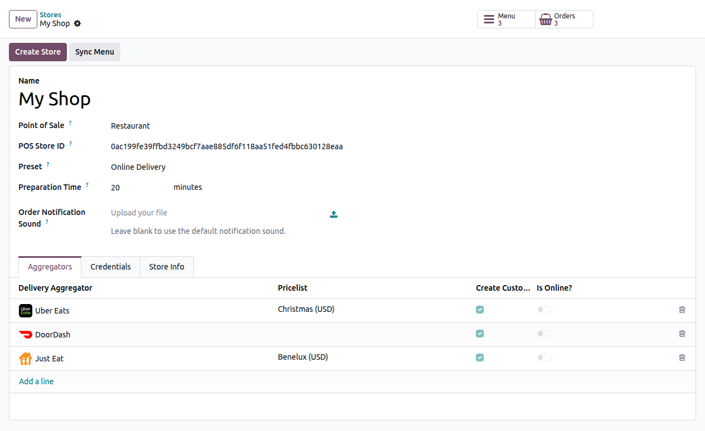
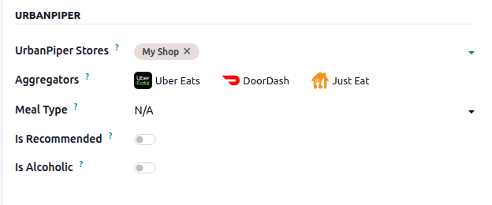

.. _pos/restaurant/online-food-delivery:

====================
Online food delivery
====================

**UrbanPiper** is an order management system that integrates with multiple food delivery
platforms. With the Odoo integration, orders from connected platforms are centralized in the Point
of Sale.

Supported providers:

.. list-table::
   :widths: 25 25 25 25

   * - `Careem <https://www.careem.com>`_
     - `Cari <https://getcari.com/>`_
     - `ChowNow <https://www.chownow.com>`_
     - `Deliveroo <https://deliveroo.co.uk/>`_
   * - `DoorDash <https://www.doordash.com>`_
     - `EatEasy <https://www.eateasy.ae/dubai>`_
     - `Glovo <https://glovoapp.com>`_
     - `Grubhub <https://www.grubhub.com>`_
   * - `HungryPanda <https://www.hungrypanda.co>`_
     - `HungerStation <https://hungerstation.com>`_
     - `Instashop <https://instashop.com>`_
     - `Jahez <https://www.jahez.net/>`_
   * - `Just Eat <https://www.just-eat.ie/>`_
     - `Keeta <https://www.keeta-global.com/SA/en>`_
     - `Mrsool <https://mrsool.co>`_
     - `Ninja <https://ananinja.com/>`_
   * - `NoonFood <https://www.noon.com>`_
     - `Postmates <https://www.postmates.com>`_
     - `Radyes <https://lyveglobal.com/>`_
     - `Rafeeq <https://www.gorafeeq.com/en>`_
   * - `Rappi <https://about.rappi.com/>`_
     - `Smiles <https://smiles.ae>`_
     - `SkipTheDishes <https://www.skipthedishes.com/>`_
     - `Swiggy <https://www.swiggy.com>`_
   * - `Talabat <https://www.talabat.com>`_
     - `The Chefz <https://thechefz.co>`_
     - `ToYou <https://toyou.io/>`_
     - `Uber Eats <https://www.ubereats.com>`_
   * - `Wolt <https://wolt.com/>`_
     - `Zomato <https://www.zomato.com>`_
     -
     -

.. note::
   The providers available in the :guilabel:`Aggregators` tab depend on the company's country.

Configuration
=============

Prerequisites
-------------

To use the UrbanPiper integration in a production environment, make sure the following
requirements are met:

- **UrbanPiper subscription:** A valid UrbanPiper subscription is required.

  .. note::
     For any questions about your UrbanPiper subscription, contact the account manager linked to
     your Odoo database.

- **Odoo requirements:**

  - **Odoo subscription:** An active Odoo Enterprise subscription is required. Odoo Community does
    not support this integration.
  - **Odoo version:** Odoo Enterprise version 18.0 or above.
  - **Odoo platform:** Odoo Online, Odoo.sh, and on-premise installations are supported.

- **Delivery platform reseller account:** A registered reseller account is required with each
  delivery platform to be integrated (e.g., Uber Eats, DoorDash, Careem, Deliveroo, or Zomato).

.. _online_food_delivery/credentials:

UrbanPiper credentials
----------------------

#. Get your Atlas credentials:

   #. Go to the :ref:`POS settings <pos/use/settings>`.
   #. Scroll down to the :guilabel:`Food Delivery Connector` section.
   #. Click :guilabel:`Fill this form to get Username and API Key` and fill out the survey.
#. `Go to your Atlas account <https://atlas.urbanpiper.com>`_ and retrieve your username and API
   key from :menuselection:`Settings --> API Access`.

.. image:: online_food_delivery/urban-piper-api.png
   :alt: Atlas API access

Enable the connector
--------------------

#. Go to the :ref:`POS settings <pos/use/settings>`.
#. Scroll down to the :guilabel:`Food Delivery Connector` section.
#. Enable :guilabel:`Urban Piper`.
#. In the :guilabel:`Food Delivery Store` field, select an existing store or create one from
   :menuselection:`Point of Sale --> Configuration --> UrbanPiper --> Stores`.
#. Save.

UrbanPiper store
----------------

Each point of sale is linked to a dedicated UrbanPiper store record that centralizes credentials,
aggregators, pricing, and schedule-related settings.

#. Go to :menuselection:`Point of Sale --> Configuration --> UrbanPiper --> Stores`.
#. Click :guilabel:`New`.
#. On the store form:

   #. Enter a :guilabel:`Name`.
   #. Select the :guilabel:`Point of Sale` that will receive online orders.
   #. Keep the generated :guilabel:`POS Store ID`, unless UrbanPiper instructs you to use a
      specific value.
   #. Select a :guilabel:`Preset`.
   #. Set the :guilabel:`Preparation Time`.
   #. Optionally upload an :guilabel:`Order Notification Sound` in `.mp3` format.
   #. If the company is based in India, choose the appropriate :guilabel:`Tax Type`.
#. Open the :guilabel:`Credentials` tab and enter your :ref:`UrbanPiper credentials
   <online_food_delivery/credentials>`.
#. Open the :guilabel:`Aggregators` tab and add one line per delivery platform.

   - Use :guilabel:`Pricelist` to apply platform-specific pricing during menu synchronization.
   - Disable :guilabel:`Create Customer` if Odoo should not create customer records for orders
     coming from that aggregator.

#. Open the :guilabel:`Store Info` tab and confirm the :guilabel:`City`.
#. Save, then click :guilabel:`Create Store`.

.. note::
   - A point of sale can only be linked to one UrbanPiper store.
   - After the store is created in Atlas, the :guilabel:`Create Store` button becomes
     :guilabel:`Update Store`.
   - Store creation may take 2 to 3 minutes to appear in UrbanPiper Atlas.

Preset
------

The store's :guilabel:`Preset` controls the default settings applied to incoming online orders. It
also replaces the old store-timings configuration.

#. Open the store record or go to :menuselection:`Point of Sale --> Configuration --> Presets`.
#. Select or create a preset dedicated to online food delivery.
#. Configure the preset as needed:

   - Set the default :guilabel:`Pricelist`.
   - Set the default :guilabel:`Fiscal Position`.
   - If needed, enable :guilabel:`Manage orders by time` and configure the :guilabel:`Schedule`.

#. Assign the preset to the UrbanPiper store.

.. tip::
   Restaurant databases include an :guilabel:`Online Delivery` preset by default.

Products
--------

To make a product available for online food delivery:

#. Go to :menuselection:`Point of Sale --> Products --> Products`.
#. Open the product form.
#. Go to the :guilabel:`Point of Sale` tab.
#. In the :guilabel:`Urban Piper` section:

   #. Select one or more :guilabel:`UrbanPiper Stores`.
   #. Optionally limit the product to specific :guilabel:`Aggregators`.
   #. Set the :guilabel:`Meal Type`.
   #. Optionally enable :guilabel:`Is Recommended` and :guilabel:`Is Alcoholic`.

To update multiple products at once:

#. Go to :menuselection:`Point of Sale --> Configuration --> UrbanPiper --> Stores`.
#. Open the relevant store.
#. Click the :guilabel:`Products` smart button.
#. Edit the products in list view.

.. image:: online_food_delivery/product-list.png
   :alt: Product list for bulk UrbanPiper updates

.. note::
   - UrbanPiper does not support combo products.
   - As a workaround, create a product and define combo choices as :doc:`Attributes & Variants
     <../../sales/products_prices/products/variants>`.

Synchronization
---------------

To send the menu to UrbanPiper:

#. Open the UrbanPiper store.
#. Click :guilabel:`Sync Menu`.

.. note::
   - A successful synchronization triggers a notification.
   - Store-level and aggregator-level pricelists are applied during menu synchronization.
   - Synchronization may take 2 to 3 minutes to appear in UrbanPiper Atlas.

Go live
-------

#. `Go to the Locations tab <https://atlas.urbanpiper.com/locations>`_ in your Atlas account.
#. Select the location to activate, then click :guilabel:`Request to go Live`.

   .. image:: online_food_delivery/go-live.png
      :alt: Request to go live button in the locations tab of the Atlas account

#. In the popup window:

   #. Select the platform or platforms to activate and click :guilabel:`Next`.
   #. Enter the :guilabel:`Platform ID` and :guilabel:`Platform URL` in the corresponding fields.
   #. Click :guilabel:`Request to Go Live`.

   .. image:: online_food_delivery/go-live-parameters.png
      :alt: Go live parameters

   .. note::
      To find the location's :guilabel:`Platform ID` and :guilabel:`Platform URL`:

      #. Click the location to open its setup form.
      #. Open the :guilabel:`HUB` tab.

#. Verify that the location is live:

   #. `Go to the Locations tab <https://atlas.urbanpiper.com/locations>`_ in your Atlas account.
   #. Select any provider in the :guilabel:`Assoc. platform(s)` column to review that platform's
      status for the location.

Order flow
==========

When a customer places an order through a configured delivery platform, Odoo sends a notification.
To manage the order:

#. Click :guilabel:`Review Orders` on the notification popup, or click the bag-shaped online-order
   icon and then :guilabel:`New`.

   .. image:: online_food_delivery/cart-button.png
      :alt: Cart button

   .. note::
      - The icon displays the number of orders in :guilabel:`New`, :guilabel:`Ongoing`, and
        :guilabel:`Done`.
      - :guilabel:`New` contains newly placed orders, :guilabel:`Ongoing` contains accepted
        orders, and :guilabel:`Done` contains orders ready to be delivered.

#. Select the order.
#. Click :guilabel:`Accept`.
#. When the order is accepted, its :guilabel:`Order Status` changes from :guilabel:`Placed` to
   :guilabel:`Acknowledged`.

If a :doc:`preparation display <../extra/preparation>` is configured, the accepted order is also
sent there automatically.

When the order is ready:

#. Open the orders list.
#. Select the order.
#. Click :guilabel:`Mark as ready`.
#. The :guilabel:`Order Status` changes from :guilabel:`Acknowledged` to :guilabel:`Food Ready`,
   and the order's :guilabel:`Status` changes from :guilabel:`Ongoing` to :guilabel:`Paid`.

.. tip::
   To review online orders from the backend, go to :menuselection:`Point of Sale --> Orders -->
   Orders` and use the :guilabel:`Online Food Delivery` filter.

Order rejection
---------------

To reject an order:

#. Open the orders list.
#. Select the order.
#. Click :guilabel:`Reject`.
#. Select a reason in the popup window.

.. image:: online_food_delivery/reject-order.png
   :alt: Reject order pop-up

.. important::
   **Swiggy** orders cannot be directly rejected. Attempting to reject one prompts Swiggy customer
   support to contact the restaurant. Similarly, **Deliveroo**, **Just Eat**, and
   **HungerStation** do not allow order rejection. Always follow the respective provider's
   guidelines for handling such cases.
